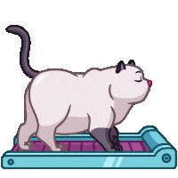

  

  💻 <i><b>Engineer</b> / <b>Developer</b></i>

  

`🌐`[`myoluk | portfolio page`](https://myoluk.github.io/ "Portfolio Page")

`🖥️` `software development`

`🎮` `game development`

`🤖` `ai (ml, dl, cv) development`

`📊` `data management`

 

🎯 professional skills <i>-click to expand-</i>

 

🚀 `Python` `C` `C#` `Java` `Spring Boot` `JavaScript` `SQL` `BigQuery` `Airflow` `Kafka` `Unity3D` `Linux` `Git`

🚀 `Cloud Computing` `OOP` `Design Patterns` `Software Development` `Game Development` `AI` `Big Data`

